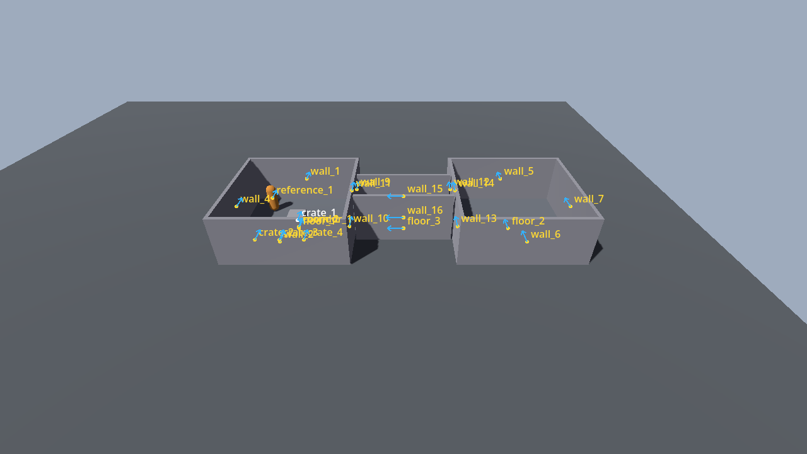
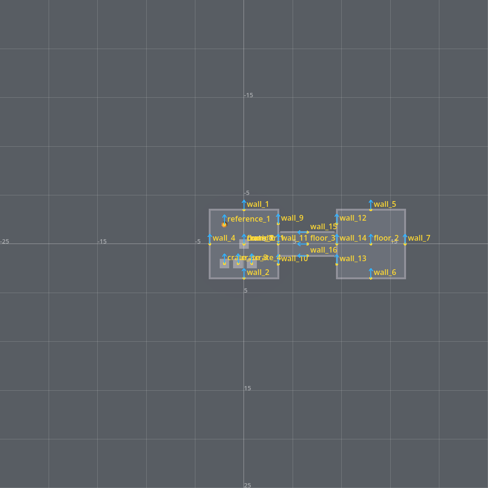

# Agentic 3D Level Editor

A Godot 4.7 "level editor" that an LLM agent drives **entirely through files**:
it appends commands to `commands.jsonl`, and perceives results through a
structured scene dump (`state.json`) plus annotated screenshots (`renders/*.png`),
iterating in a closed loop. The editor supplies the spatial precision the LLM
lacks; the LLM supplies high-level structure and verification against a goal.

Built from [`agentic-level-editor-spec.md`](agentic-level-editor-spec.md).




*Above: the §11 smoke-test level (two rooms joined by a corridor with doorways,
cover crates, reference capsule), built entirely by appending command batches —
top view shows the ground grid, coordinate ticks, object labels and forward arrows.*

## Architecture

One persistent **windowed** Godot process holds the scene (the single source of
truth) and exposes itself purely through the filesystem — no network, no MCP,
no sockets.

```
  AGENT  ──append──►  io/commands.jsonl   ──watch+exec──►  GODOT PROCESS
 (Claude)◄──read────  io/results.jsonl    ◄──append──────  (holds scene,
         ◄──read────  io/state.json       ◄──dump─────────   is truth)
         ◄──view────  renders/*.png       ◄──render───────
```

## Layout

```
project/
  project.godot, main.tscn, main.gd   # entry: command-watch loop + dispatch
  tools/                              # one .gd per tool group:
    actions.gd      # spawn/move/rotate/scale/align/distribute/array/group
    grounding.gd    # raycast_screen/snap/gravity_drop/overlap/measure
    camera_tools.gd # set_camera/bookmark/frame_selection
    generators.gd   # make_room/corridor/stairs/opening
    verify.gd       # check_support/overlaps/scale/reachable + goal checklist
    meta.gd         # checkpoint/restore/undo/redo/log_intent/audit
  CLAUDE.md         # operating manual for the driving agent (read this to drive it)
run.sh / run.bat    # launch (add --minimized to run off-screen)
engine/             # Godot 4.7 binary (gitignored — see below)
```

## Setup

The Godot binary is not committed (~178 MB). Download **Godot 4.7-stable,
standard (non-.NET) Windows build** and place it at:

```
engine/Godot_v4.7-stable_win64.exe
engine/Godot_v4.7-stable_win64_console.exe   # console build, for stdout
```

## Run

```bash
bash run.sh                # windowed — watch the agent build live
bash run.sh --minimized    # window off-screen; renders still produced
```

On launch it builds a ground plane, a grey box, and a 1.8 m reference capsule,
then writes `state.json` and the canonical renders. It then watches
`io/commands.jsonl` and executes any appended batch.

## Driving it

See [`project/CLAUDE.md`](project/CLAUDE.md) for the command protocol,
`state.json` schema, coordinate convention, the full command catalog, and the
per-cycle operating loop. A worked end-to-end example (two rooms + corridor,
navmesh reachability, clean audit) is the §11 smoke test in the spec.

## Status

All build phases (0–6) complete and verified live; the §11 smoke test passes
(two reachable rooms via a corridor, zero floaters/overlaps/scale-warnings).

## Before you modify the editor

Read [`NOTES-for-agents.md`](NOTES-for-agents.md) — hard-won gotchas (runtime
navmesh re-baking, floor-seam connectivity, collider-transform timing, the
off-screen-vs-minimized window trap, GDScript type-inference) that cost real
debugging and are easy to reintroduce.
